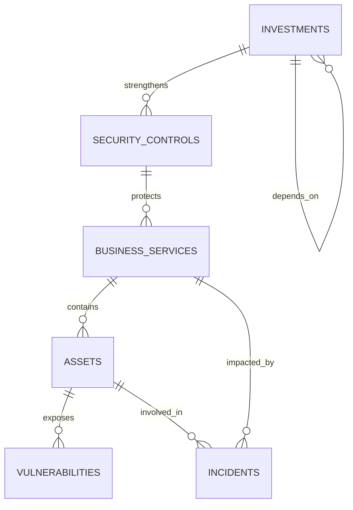

# SIH 26105 — Synthetic End-to-End Demonstration Dataset

> [!WARNING]
> **SYNTHETIC DATA NOTICE:**  
> **"Synthetic SIH 26105 demonstration data — not production data."**  
> All hostnames, IP addresses, vulnerability entries, incident summaries, and financial loss quantifications in this directory are synthetic records generated strictly for testing, benchmarking, and demonstrating the SIH 26105 Cyber Risk Quantification & Investment Optimization platform. They do not represent real-world corporate assets, active production vulnerabilities, or real corporate breaches.

---

## 1. Overview & Organization

- **Target Organization:** `Demo Financial Services Ltd.`
- **Industry Sector:** Banking & Financial Services (BFSI)
- **Currency:** Indian Rupee (INR / ₹)
- **Scale:** Tier-1 scheduled commercial banking operations with digital payment processing, retail internet banking, core banking ledger, and partner integrations.

This dataset provides an internally consistent, schema-aligned test suite designed to evaluate the platform end-to-end without requiring modification of existing source code or database schemas.

---

## 2. Directory Structure & Files Created

```
demo-data/
├── 01_assets.csv                      # 25 Enterprise production assets
├── 02_vulnerabilities.csv             # 30 Synthetic CVEs mapped to assets
├── 03_controls.csv                    # 14 Security controls with coverage & effectiveness
├── 04_incidents.csv                   # 16 Synthetic historical security incidents
├── 05_business_services.csv           # 10 Tiered financial business services
├── 06_investments.csv                 # 14 Prioritized cybersecurity initiatives
└── changes/
    └── 07_new_critical_vulnerability.csv # Controlled zero-day injection (CVE-2026-9999)
```

---

## 3. Schemas & Column Definitions

### 3.1 Business Services (`05_business_services.csv`)
- **Record Count:** 10
- **Primary Key:** `id` (`SVC001` to `SVC010`)
- **Columns:**
  - `id`: Unique service identifier (`SVC001` - `SVC010`)
  - `name`: Business service title (e.g. `Payment Gateway`, `Customer Internet Banking`)
  - `code`: Service acronym code (`SRV-PAY`, `SRV-CBS`, etc.)
  - `tier`: Criticality tier (`Tier 1`, `Tier 2`, `Tier 3`)
  - `criticality`: Business impact level (`Critical`, `High`, `Medium`, `Low`)
  - `business_impact_score`: Normalized impact score `[0.0, 100.0]`
  - `financial_loss_per_hour`: Estimated business outage loss in INR/hour
  - `owner`: Business service owner and executive title
  - `status`: Operational state (`Operational`, `Degraded`, `Under Maintenance`)
  - `description`: Scope of transaction processing and banking function
  - `confidence`: Telemetry confidence rating `[0.0, 100.0]`

### 3.2 Assets (`01_assets.csv`)
- **Record Count:** 25
- **Primary Key:** `asset_id_code` (`A001` to `A025`)
- **Foreign Key:** `business_service_id` $\rightarrow$ `05_business_services.csv.id`
- **Columns:**
  - `asset_id_code`: Unique asset identifier (e.g., `A001` = `payment-api-prod-01`)
  - `name`: Human-readable host/resource designation
  - `asset_type`: Infrastructure type (`API Gateway`, `Server`, `Database`, `Cloud Service`, `Endpoint`)
  - `ip_address`: Assigned network interface IP
  - `hostname`: Fully qualified domain name
  - `exposure`: Network exposure perimeter (`Internet-Facing`, `DMZ`, `Internal`, `Partner`)
  - `criticality`: Asset importance rating (`Critical`, `High`, `Medium`, `Low`)
  - `business_service_id`: Foreign key reference (`SVC001` - `SVC010`)
  - `business_service`: Matching name of associated business service
  - `owner`: Responsible engineering or operations squad
  - `data_classification`: Sensitivity category (`Restricted`, `Confidential`, `Internal`, `Public`)
  - `control_coverage`: Percentage of baseline controls active `[0.0, 100.0]`
  - `status`: Lifecycle state (`Active`)
  - `environment`: Deployment tier (`Production`)

### 3.3 Vulnerabilities (`02_vulnerabilities.csv`)
- **Record Count:** 30
- **Primary Key:** `cve_id` + `asset_id_code`
- **Foreign Key:** `asset_id_code` $\rightarrow$ `01_assets.csv.asset_id_code`
- **Columns:**
  - `cve_id`: CVE identifier format (e.g., `CVE-2024-3094`, `CVE-2023-38606`)
  - `asset_id_code`: Target asset hosting the affected software component
  - `title`: Flaw summary
  - `description`: Technical explanation with synthetic disclosure disclaimer
  - `severity`: CVSS v3.1 tier (`Critical`, `High`, `Medium`, `Low`)
  - `cvss_score`: Base numeric score `[0.0, 10.0]`
  - `exploitability_score`: CVSS exploitability sub-score `[0.0, 10.0]`
  - `status`: Remediation lifecycle (`Open`, `In Progress`, `Mitigated`, `Resolved`)
  - `epss_score`: FIRST Exploit Prediction Scoring System probability `[0.0, 1.0]`
  - `epss_percentile`: National vulnerability percentile ranking `[0.0, 1.0]`
  - `is_cisa_kev`: Flag indicating inclusion in CISA Known Exploited Vulnerabilities (`TRUE`/`FALSE`)
  - `kev_date_added`: Catalog addition timestamp (`YYYY-MM-DD` or empty)
  - `affected_product`: Software package or hardware firmware name
  - `cpe_uri`: Standard Common Platform Enumeration 2.3 string
  - `confidence_score`: Telemetry validation confidence rating `[0.0, 100.0]`
  - `source`: Intelligence feed origin
  - `remediation_guidance`: Prescriptive engineering remediation instruction

### 3.4 Controlled Critical Change (`demo-data/changes/07_new_critical_vulnerability.csv`)
- **Record Count:** 1
- **Target:** Asset `A001` (`payment-api-prod-01`), Business Service `Payment Gateway` (`SVC001`)
- **Vulnerability:** `CVE-2026-9999`
- **Severity:** `CRITICAL`
- **CVSS:** `9.8`
- **Exploit Available:** `TRUE`
- **Purpose:** Used to trigger the live continuous risk recalculation, driver breakdown, and WebSocket event surge demonstration.

### 3.5 Security Controls (`03_controls.csv`)
- **Record Count:** 14
- **Primary Key:** `code` (`CTL-MFA`, `CTL-SEG`, `CTL-WAF`, etc.)
- **Columns:**
  - `code`: Standardized control code
  - `name`: Formal security control title
  - `category`: Defense tier (`Identity`, `Network`, `AppSec`, `Endpoint`, `Operations`, `Data`)
  - `coverage_pct`: Current organizational deployment coverage `[0.0, 100.0]`
  - `effectiveness_pct`: Measured control operational effectiveness `[0.0, 100.0]`
  - `risk_reduction_weight`: Engine mitigation discount factor `[0.10, 0.26]`
  - `evidence_quality_score`: Telemetry audit quality index `[0.0, 100.0]`
  - `owner`: Designated technical custodian
  - `implementation_state`: Status (`Implemented`, `Partially Implemented`, `Planned`)
  - `associated_services`: Semicolon-delimited list of protected business service IDs
  - `description`: Architectural enforcement scope

### 3.6 Incidents (`04_incidents.csv`)
- **Record Count:** 16
- **Primary Key:** `incident_number` (`INC-2026-1001` to `INC-2026-1016`)
- **Foreign Keys:** `asset_id_code` $\rightarrow$ `01_assets.csv`, `business_service_id` $\rightarrow$ `05_business_services.csv`
- **Columns:**
  - `incident_number`: Unique SOC incident ticket ID
  - `title`: Alert summary
  - `incident_type`: Category (Brute-Force, Malware, DDoS, Exfiltration, etc.)
  - `severity`: SOC severity rating (`Critical`, `High`, `Medium`, `Low`)
  - `status`: Incident resolution state (`Closed`, `Investigating`, `Mitigated`)
  - `asset_id_code`: Primary involved asset
  - `business_service_id`: Impacted business service
  - `business_service`: Associated service title
  - `estimated_financial_loss`: Modeled forensic remediation and downtime cost in INR
  - `detected_at`: Detection timestamp (`YYYY-MM-DD HH:MM:SS`)
  - `resolved_at`: Containment/closure timestamp
  - `description`: SOC correlation narrative and mitigation action

### 3.7 Investments (`06_investments.csv`)
- **Record Count:** 14
- **Primary Key:** `code` (`INV-MFA-01` to `INV-TRAIN-14`)
- **Columns:**
  - `code`: Unique investment code
  - `name`: Initiative project name
  - `category`: Domain (`Identity & Access`, `Network Security`, `Endpoint Security`, etc.)
  - `one_time_cost`: Initial capital expenditure (CapEx) in INR
  - `recurring_cost`: Annual operational expenditure (OpEx) in INR
  - `expected_risk_reduction`: Modeled enterprise risk reduction points
  - `implementation_weeks`: Estimated time to operational readiness
  - `capacity_requirement`: Organizational workload (`Low`, `Medium`, `High`)
  - `is_mandatory`: Boolean constraint flag for OR-Tools knapsack solver
  - `dependencies`: JSON list of prerequisite initiative codes
  - `confidence_pct`: Actuarial and engineering confidence percentage
  - `affected_services`: Impacted business services
  - `affected_controls`: Associated security controls strengthened
  - `description`: Executive project justification

---

## 4. Entity Relationships & Dependency Graph



### Verified Relational Constraints:
- **Every Asset ($25/25$):** Has a valid `business_service_id` pointing to an existing service in `05_business_services.csv`.
- **Every Vulnerability ($30/30$):** Targets an existing `asset_id_code` in `01_assets.csv`.
- **Every Incident ($16/16$):** References both an existing `asset_id_code` and `business_service_id`.
- **Every Investment Prerequisite:** Dependency references (e.g., `INV-SEG-02` $\rightarrow$ `INV-MFA-01`, `INV-PAM-07` $\rightarrow$ `INV-MFA-01`, `INV-SOAR-11` $\rightarrow$ `INV-SIEM-08`) form an acyclic directed graph with zero orphan references.

---

## 5. End-to-End Guided Demonstration Workflow

The dataset is explicitly structured to support the 15-step platform demonstration:

1. **Open Executive Overview:**
   The user opens the dashboard (`/`). Global baseline risk displays across all 25 assets and 10 business services.
2. **Show Current Risk Landscape:**
   Navigate to `/landscape`. Inspect the Likelihood vs. Impact 2D risk heatmap with asset bubbles sized by exposure (`Internet-Facing` = largest).
3. **Open Payment Gateway:**
   Click into the `Payment Gateway` (`SVC001`) service cluster.
4. **Inspect Assets & Vulnerabilities:**
   Observe focus asset `A001` (`payment-api-prod-01`), currently showing baseline CVEs (`CVE-2023-44487` and `CVE-2024-20353`). Asset baseline risk is calibrated around $61.0$.
5. **Show Risk Drivers:**
   View the decomposed drivers: Internet Exposure ($+18.0$), High CVSS ($+14.0$), Tier-1 Criticality ($+13.0$), offset by EDR ($ -8.0$).
6. **Ingest Controlled Zero-Day (`CVE-2026-9999`):**
   Simulate evidence arrival by ingesting `demo-data/changes/07_new_critical_vulnerability.csv` via the Evidence Center or API route `/api/v1/sources/nvd/sync`.
7. **Recalculate Risk via Engine:**
   The risk engine executes $R = L \times I \times \text{Exposure} \times \text{Control}$. Likelihood jumps from $63.8 \rightarrow 83.3$.
8. **Observe Risk Surge:**
   `A001` risk score increases from $\sim 61.0 \rightarrow 84.0$. Enterprise global score moves upward.
9. **Inspect Updated Risk Drivers & History:**
   The new driver *"Critical Vulnerability (CVSS 9.8)"* ($+21.0$) dominates the breakdown. A new `RiskSnapshot` entry is recorded in risk history.
10. **Create Control Scenario:**
    Open `/scenarios`. Formulate a what-if simulation:
    - Deploy Phishing-Resistant MFA (`CTL-MFA`, $85\%$ effectiveness, $95\%$ coverage)
    - Enforce Zero Trust Micro-Segmentation (`CTL-SEG`, $90\%$ effectiveness, $95\%$ coverage)
11. **Compare Baseline vs. Scenario:**
    Simulator projects `A001` risk dropping from $84.0 \rightarrow 52.0$ ($-32.0$ points reduction), saving ₹5,00,000/hr in modeled outage exposure.
12. **Run Investment Optimizer:**
    Open `/optimization`. Set Total Budget to **₹50 Lakh** (`5,000,000` INR).
13. **Compare Available Portfolios:**
    Google OR-Tools MIP solver evaluates candidate initiatives from `06_investments.csv`. Under budget constraints, it selects:
    - `INV-MFA-01` (Universal FIDO2 MFA — Mandatory, ₹12.0L)
    - `INV-BAK-05` (Immutable Ransomware Vault — Mandatory, ₹22.0L)
    - `INV-PATCH-04` (Automated Patching Pipeline, ₹5.0L)
    - `INV-CSPM-13` (Cloud Security Posture Management, ₹6.0L)
    - `INV-TRAIN-14` (Continuous Secure Code Training, ₹4.0L)
    - **Total Budget Utilized:** ₹49.0 Lakh ($98\%$ budget utilization).
    - **Modeled Risk Reduction:** $34.0$ points.
14. **Generate Report:**
    Navigate to `/reports`. Export dynamic PDF and CSV summary reflecting current state and investment recommendations.
15. **Inspect Audit Trail:**
    Navigate to `/audit`. Verify immutable logging of vulnerability ingestion, risk recalculation, scenario execution, and optimization solution.

---

## 6. Data Reload & Reset Mechanisms

The existing project includes built-in database initialization and reset tools:

### Complete Database Reset (Wipe & Re-seed)
To reset the platform database back to its pristine state:
```powershell
cd "d:\New folder\backend"
python reset_demo.py
```
This executes `Base.metadata.drop_all(bind=engine)`, re-creates all 20 tables via Alembic/SQLAlchemy, and seeds the canonical baseline environment.

### Ingesting Asset CSV through the Live Backend
To upload `01_assets.csv` directly into the running platform:
```powershell
curl -X POST "http://127.0.0.1:8000/api/v1/sources/assets/upload" `
  -H "accept: application/json" `
  -F "file=@demo-data/01_assets.csv;type=text/csv"
```

---

## 7. Data Verification & Integrity Test Results

All generated files were tested using automated integrity verification against the live codebase:

```text
[CHECK 1] Business Services: 10/10 unique IDs, 0 orphans.
[CHECK 2] Assets: 25/25 unique assets, all 25 map to valid business services. Target A001 verified.
[CHECK 3] Vulnerabilities: 30/30 valid CVE formats, CVSS scores [0.0 - 10.0], all target valid assets.
[CHECK 4] Controlled Change: Targets A001 (Payment Gateway) with CVE-2026-9999 (CVSS 9.8, CRITICAL).
[CHECK 5] Incidents: 16/16 unique incident IDs, zero orphan asset or service references.
[CHECK 6] Security Controls: 14/14 unique control codes, valid coverage and effectiveness ranges.
[CHECK 7] Investments: 14/14 unique investment codes, zero broken dependency references.
[CHECK 8] Google OR-Tools MIP Solver Execution: OPTIMAL solution found under ₹50 Lakh budget cap (₹49 Lakh utilized, 34.0 pts reduction).
```
